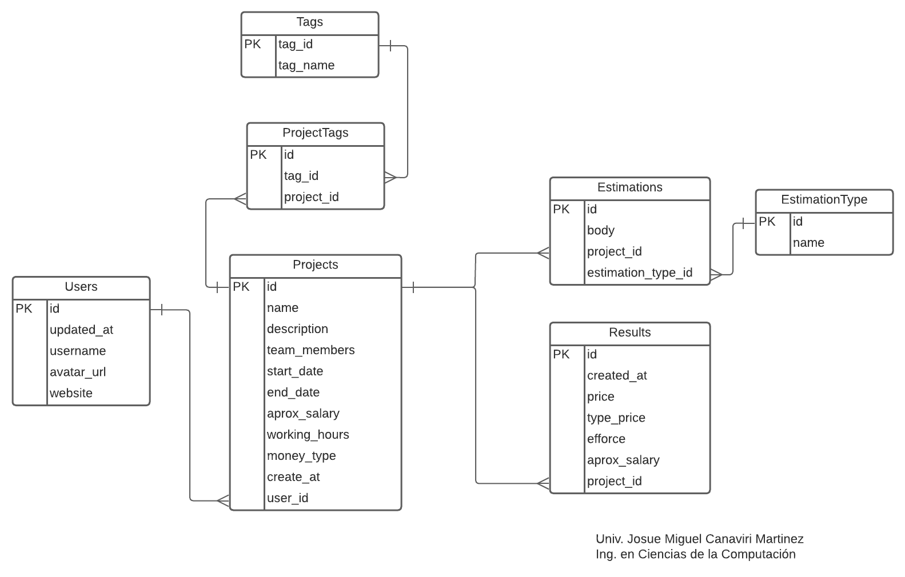
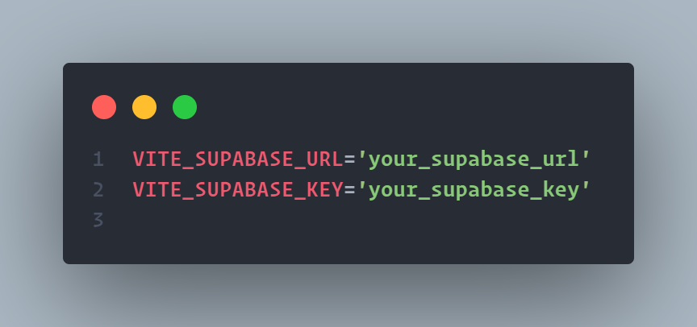

# Estimate App ⌛

### Autor:
🧑‍🎓 *Nombre:* Josue Miguel Canaviri Martinez

🏃‍♂️ *Carrera:* Ing. Ciencias de la Computación

### Requisitos del Sistema 💻:
* 👽 Nodejs v16.14.2 
* 🐈 yarn 1.22.19 

### Requisitos del Proyecto 📓:
* ⚛️ Conocer un poco react
* 🤔 Contar con una cuenta en supabase
* 🏗️ Saber un poco de base de datos relacionales

### Pasos para reproducir el Proyecto 🚶‍♂️:

```shell
# Clonamos el proyecto
$ git clone https://github.com/jcanaviri/react-grade-project.git
```

```shell
# Accedemos al proyecto y instalamos las dependencias necesarios
$ cd react-grade-project
$ yarn
```

> En este punto se debe haber creado una cuenta nueva en Supabase y crear un nuevo proyecto en el dashboard puede llamarse con cualquier nombre


> Supabase es un BaaS(Backend as a Service) que proporciona un amplia lista de servicios de forma gratuita. 😀

> Pero no todos son gratuitos como por ejemplo el backup a la base de datos 😭. Asi que para este punto es necesario que se cree la base de datos en el editor de supabase bajo el siguiente diagrama:




```shell
# Copiamos las credenciales proporcionadas por Supabase al archivo de variables
$ cp .env.example .env # Copia el archivo de variables de ejemplo
```

El archivo debe ser llenado de la siguiente forma:



Una vez hechas estos pasos ya estamos listos para correr el proyecto 🧑‍💻:
```shell
$ yarn dev
```
Y ya esta 🙈😅
